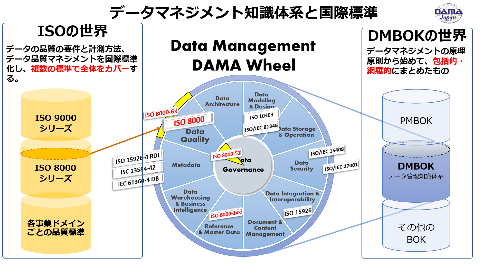
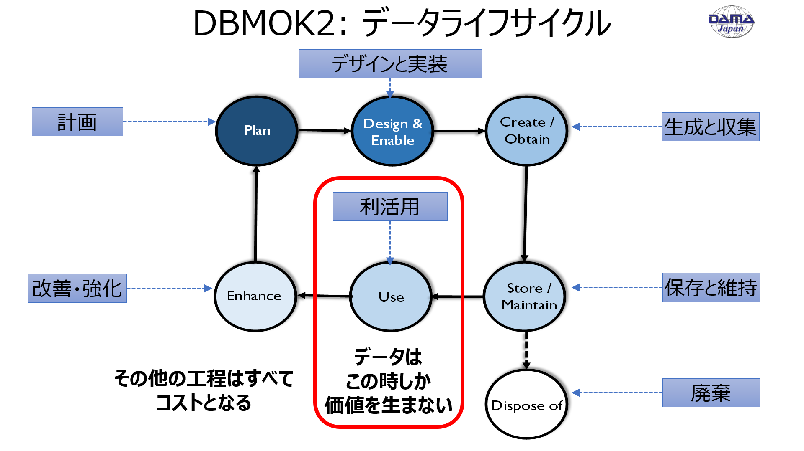
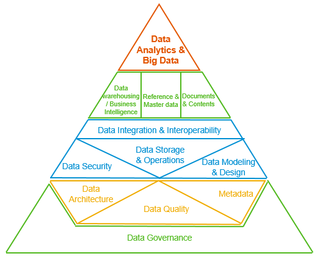
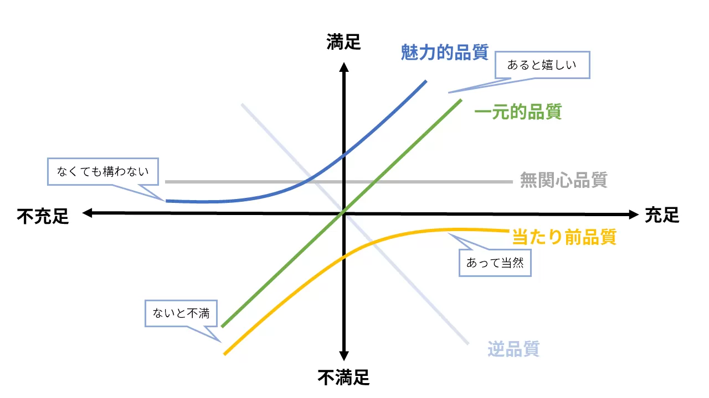
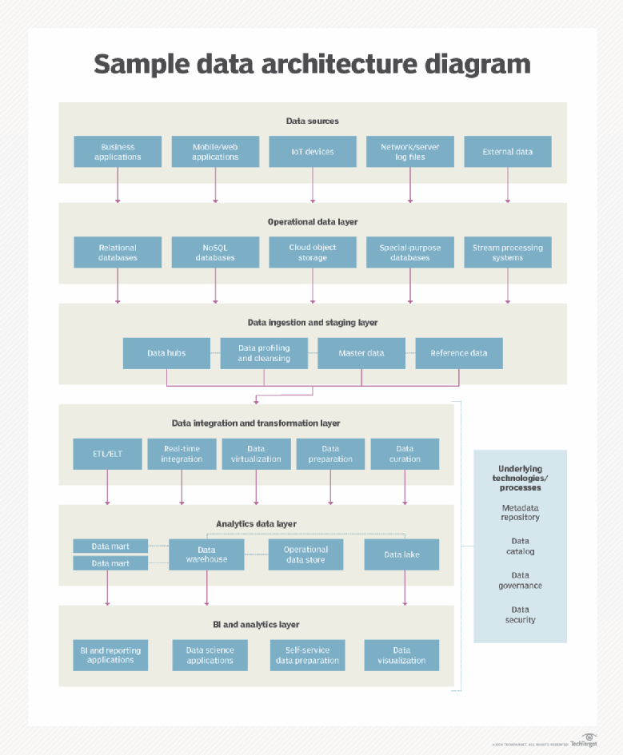
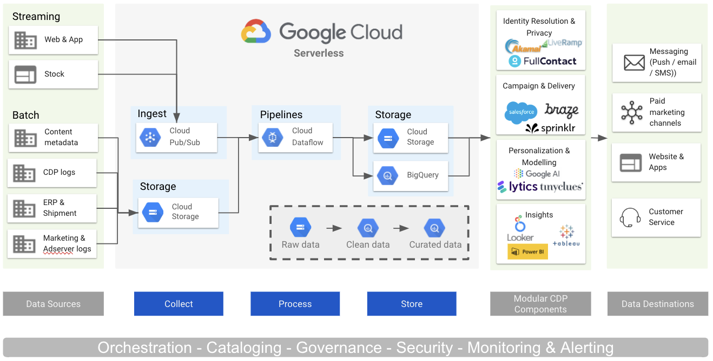
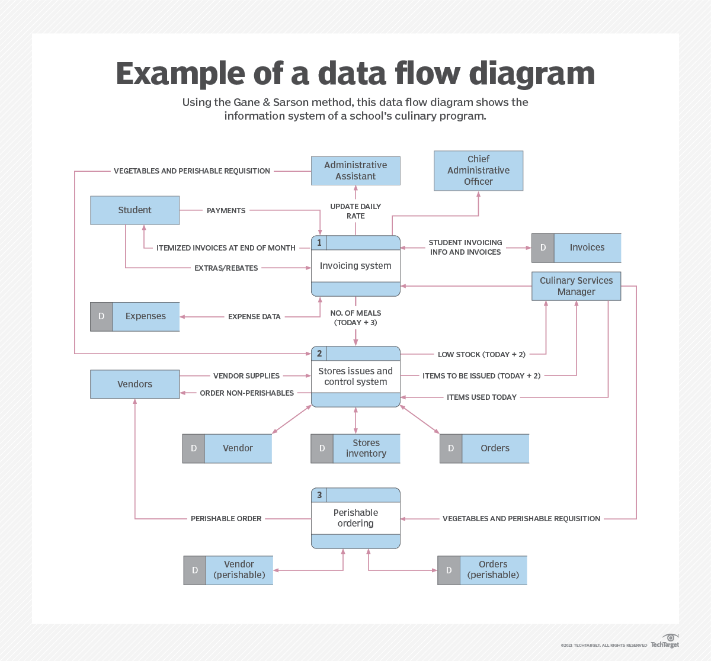
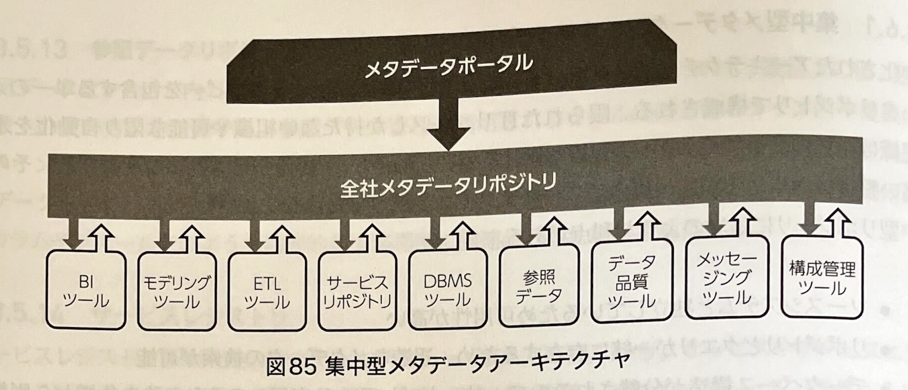
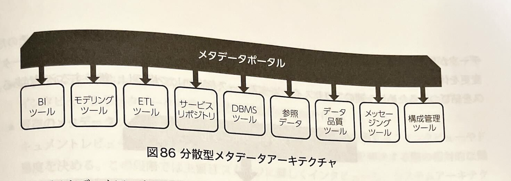
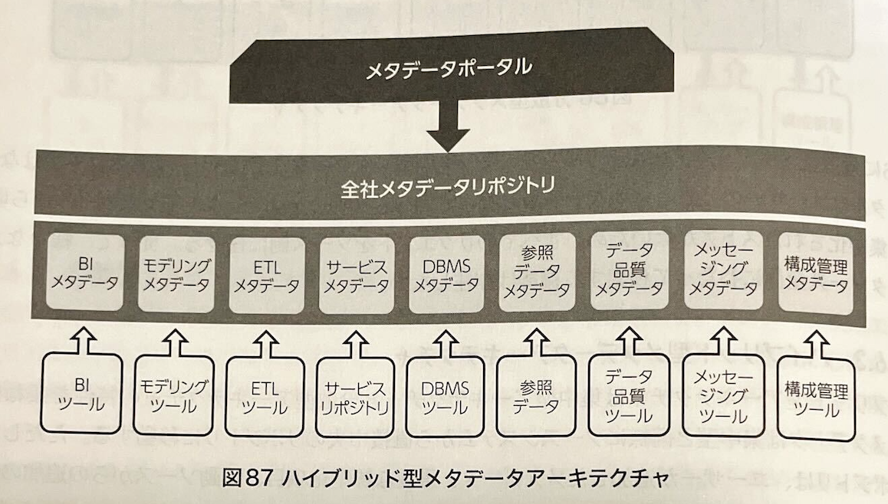

## はじめに

データマネジメントの知識領域が定義された DAMA ホイール図を見ると、ぱっと見はデータ品質はその１項目にすぎないモノのように感じてしまいます。  
しかし実際には、データマネジメントという活動自体がデータ品質を向上させる活動として捉えることもできます。  
また、データライフサイクルについての理解も必要です。
データは利活用された時だけ価値を生み、それ以外の工程はすべてコストが発生します。  
以降で説明する「データ品質の３要素」はコストを下げるという観点において使わなくなったモノはしっかりして破棄していくことも必要な要素になりそうです。
データマネジメントの知識領域に階層をつけて分類した図として Aiken のピラミッドがあります。  
この図においては、 データ品質を支える取り組みとしてデータガバナンスに次に重要な要素として「データ品質管理」「データアーキテクチャ」「メタデータ管理」をデータ品質に関連する３要素として説明されています。  
以降では、Aiken のピラミッドにおけるデータ品質の３要素における要所を確認し、実現していくための流れについて考察します

### 参考資料
  - DAMA ホイール図
    - https://www.dama-japan.org/Introduction.html
    - 
  - データライフサイクル図
    - https://www.dama-japan.org/Introduction.html
    - 
  - Aiken のピラミッド
    - https://blogs.sap.com/2020/07/09/why-hr-data-management-strategy-is-important-in-your-hr-transformation/
    - 

## データ品質の要件定義

データ品質に関するに関する要件について考えていきます。そもそもデータ品質というカテゴリに対する要件について考える際は、非機能要件として何を満たすべきか考えていく必要があります。  
非機能要件は多岐に渡り、  RASIS を参考にすると 「Reliability(信頼性)」, 「valability(可用性)」, 「Serviceability(保守性)」, 「Integrity(完全性)」, 「Security(機密性)」 に分解して考えることができます。  
非機能要件は非常に多岐に渡るので、全てを満たそうとするのは得策ではありません。  
狩野モデルを参考に、まずは「当たり前品質」を満たすことを考え次いで「魅力的品質」を満たすための要件を定義していくことを考えます。  
以降では、 Aiken のピラミッドにおけるデータ品質の３要素に分解して考えていきます。

#### 参考資料
- https://service.shiftinc.jp/column/8639/
- https://shiftasia.com/ja/column/%E7%8B%A9%E9%87%8E%E3%83%A2%E3%83%87%E3%83%AB%E3%81%8B%E3%82%89%E6%8E%A2%E3%82%8B%E5%93%81%E8%B3%AA/
- 

### データ品質管理

DMBOK に記載されている内容をもとに要件定義で実施すべきであろう事項を整理していきます。
データ品質管理のアクティビティとしては以下が記載されています。
1. 高品質データを定義する
2. データ品質戦略を定義する
3. 優先されるデータと業務ルールを特定する
4. 最初のデータ品質アクセスメントを実施する
5. 実現可能な改善点を特定して優先順位を潰える
6. データ品質向上の目標を策定する
7. データ品質大江レーションを開発し展開する
要件定義フェーズにおいては、上記 1-3 に該当するアクティビティを実施する必要があると考えています。

#### 1. 高品質データを定義する
まずはステークホルダーにとって「高品質なデータ」とは何かを定義するためには、ビジネス戦略とゴールを理解して落とし込む必要があります。  
KGI や KPI に対して、より貢献できる状態が「高品質なデータ」であり、悪影響を及ぼす状態が「低品質なデータ」であると考えています。  
日々行われるであろう分析や ML の業務が実施可能な状態・不可能な状態・許容可能な状態を落とし込んで定義していく必要がありそうです。

#### 2. データ品質戦略を定義する
ビジネス戦略に沿ってデータに対する優先順づけ・横展開を見据えた品質の標準化について考えておく必要がありそうです。

#### 3. 優先されるデータと業務ルールを特定する
まずは最も重要なデータに焦点を当てる必要があります。  
業務ニーズを理解し、重要性を分析した結果としてデータをランク付けしたリストを提示できれば焦点を絞ることができます。
また、定義上最も重要なデータはマスタデータです。
優先すべきデータを特定した後は、品質を左右する業務ルールを関係者へのヒアリングを通じて特定します。  

### データアーキテクチャ

ビジネス要求に答えるためのデータをどこから集めて誰に活用してもらうかの流れを可視化すると関係者間の合意形成に役立つと考えます。  
いわゆる DFD (data flow diagram) と呼ばれるものは粒度が異なるだけでデータアーキテクチャの一種と考えています。  
実施する要件定義のスコープに合わせて、関係者で認識を揃えるために必要な内容によって粒度を選択することが必要と思われます。  
また、利用する技術スタックも合わせて図示した資料を作成することもよく見られます。

- 参考図引用
  - データアーキテクチャ
    - 
    - https://www.techtarget.com/searchdatamanagement/definition/What-is-data-architecture-A-data-management-blueprint
  - データアーキテクチャ（技術スタック込み）
    - https://www.crystalloids.com/insights/3-best-practices-to-design-cdp-architectures-on-google-cloud-platform
    - 
  - DFD
    - https://venngage.com/blog/data-flow-diagram/
    - 

### メタデータ管理
メタデータの一般的な定義は「データに関するデータ」ですが、メタデータとして分類できる情報の種類はとても幅広いです。
メタデータとは何か？を考えると、一般的には「データに関するデータ」と言う定義を良く耳にします。  
しかしこれだけでは、メタデータとして分類できる情報の種類はとても幅広くなりどこまでをメタデータとして扱って良いのかを難しくさせてしまいます。  
さらには、「実」データとメタデータの境界線も曖昧です。  
同じデータでも、利用者の目線によっては利用したい「実」データなのかメタデータといった分類が異なる可能性があります。  
そして、メタデータも一種のデータであるため他のデータと同様に管理する必要があります。  
そのためメタデータ管理を始める際は、メタデータが何のために必要なのかという目的を考えて焦点を絞る必要がありそうです。  
  - 新しいデータを作成する
  - 既存のデータを理解する
  - システム間のデータ移動を可能にする
  - データへアクセスする
  - データを共有する
  - etc...

#### メタデータ要件の把握
まずは主要なステークホルダーにインタビューや、ドキュメントの確認を通じて出てきた問題を解決するための難易度を評価する必要があります。  
解決可能と判断した場合は、必要なメタデータの洗い出し・分類を行った後にメタデータを管理するアーキテクチャを定義していく必要があります。

#### メタデータの種類
メタデータは「ビジネスメタデータ」「テクニカルメタデータ」「オペレーショナルメタデータ」の３つに分類されます。  
このカテゴリ分けの目的はどこで生成されるデータかの判別を容易にすることにあるため、利用目線ではなく生成目線で分類します。

#### メタデータアーキテクチャの定義

メタデータのカテゴリ分けを実施できたら、最終的に手に入れたいメタデータを収集・統合するためのデータソースが特定されていると思われます。  
あとは、「実」データを統合するアーキテクチャを考えるのと同様にメタデータを統合管理するためのアーキテクチャを考えていけば良さそうです。  
メタデータ管理システムは多くのソースからメタデータを抽出しなければならない構成になることが予想されます。  
また、データソースの更新が自動ではなく手動での更新が伴う可能性もあります。  
そのため、データソースの取得・更新のオペレーションまで意識してアーキテクチャを考えていく必要があります。  

メタデターのアーキテクチャには、集中型・分散型・ハイブリッド型の３種類から状況に適したアーキテクチャを選択していく必要があります
- 参考図（DMBOK より）
  - 
  - 
  - 

## 参考
- https://blogs.sap.com/2020/07/09/why-hr-data-management-strategy-is-important-in-your-hr-transformation/
- https://speakerdeck.com/mixi_engineers/2023-datamanagement-training
- https://note.com/zono_data/n/ncc0fee7dd80d
- https://note.com/zono_data/n/n51dc41c3c9e5
- https://note.com/zono_data/n/n2b8c25f51d1c
- https://techblog.kazaneya.com/20231218-dataquality/
